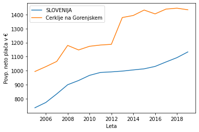
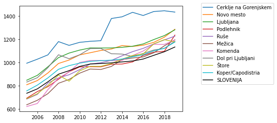
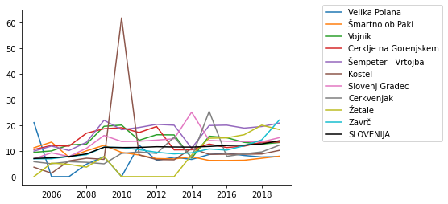
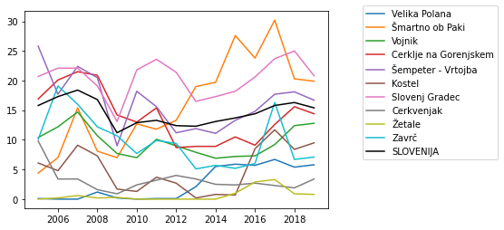
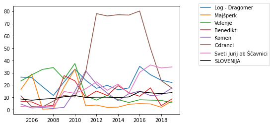

# Razporeditev povp. plač po slovenskih občinah

## Opis problema

Izbran problem (oziroma zbirka podatkov) je Povprečne mesečne plače po občinah, Slovenija, letno.

Problem zajema povprečne bruto in neto plače po občinah v Sloveniji, z dodatnimi podatki kot so opravljene (oz. plačane) nadure, število oseb, ki so opravljale nadure na mesec, število oseb, ki so prejele zaostala izplačila itd.

Vse vrednosti so povprečne mesečne vrednosti, ki so razdeljena na leta (npr. povp. neto plača na mesec v letu 2015 itd.)

Ti podatki podajo več zanimivih vprašanj, kot npr.:
  * V katerij regijah Slovenije so plače višje/nižje?
  * Kako izgleda rast/upad plač skozi leta (posledice recesije?)?
  * Kje je opravljenih največ nadur, in kje so te najbolje plačane?
  * Kakšne so vrednosti, če upoštevano/primerjmo inflacijo?
  
Cilj je seveda analiza, pregled in vizualizacija teh podatkov, ter njihova razdelitev po regijah. Zanima nas tudi razporeditev plač po Sloveniji.

## Podatki

V podatkovni datoteki so podane sledeče vrednosti:
 * Povprečna mesečna bruto plača
 * Povprečna mesečna neto plača
 * Indeks povprečne mesečne bruto plače
 * Indeks povprečne mesečne neto plače
 * Povprečna plača za plačano naduro
 * Povprečna mesečna bruto plača za plačano uro
 * Povprečna mesečna neto plača za plačano uro
 * Indeks povprečne mesečne bruto plače za plačano uro
 * Indeks povprečne mesečne neto plače za plačano uro
 * Zaposlene osebe, ki so prejele zaostala izplačila
 * Zaposlene osebe z izplačanimi nadurami
 
Vrednosti so za leta od 2005 do 2019, in so povprečja celotnega leta za posamezne občine v Sloveniji (katerih je 211).

Pred čiščenjem je bilo v podatkih skupaj 700 praznih vrednosti (v podatkih označenih z "-").

Iz podatkov sva odstranila vnose za občine Ankaran in Mirna, saj so tem občinam manjkali podatki za vrsto let (tako je skupaj 209 občin). Odstranila sva tudi leto 2005 za indeks povprečne mesečne plače za plačano uro, saj je to leto bilo popolnoma prazno.

Za potrebe analize sva uporabljala samo neto vrednosti (namesto bruto), saj ponujajo boljšo predstavitev dejanskega denarnega prihodka za posamezno občino.

## Predstavitev podatkov

### Povprečna neto plača

Pri vseh letih je največja plača v občini **Cerklje na Gorenjskem**. 

|                       |   2005 |    2006 |    2007 |    2008 |    2009 |    2010 |    2011 |    2012 |    2013 |    2014 |    2015 |    2016 |    2017 |    2018 |    2019 |
|:----------------------|-------:|--------:|--------:|--------:|--------:|--------:|--------:|--------:|--------:|--------:|--------:|--------:|--------:|--------:|--------:|
| Cerklje na Gorenjskem | **994.07** | **1028.63** | **1065.88** | **1179.98** | **1147.61** | **1173.7**  | **1182.71** | **1187.71** | **1378.65** | **1393.08** | **1431.88** | **1404.53** | **1438.7**  | **1445.17** | **1433.9**  |
| SLOVENIJA | 735.73 | 773.42 |  834.5 |  899.8 |    930 | 966.62 | 987.39 | 991.44 | 997.01 | 1005.41 | 1013.23 | 1030.16 |   1062 | 1092.74 | 1133.5 |'

**Cerklje na Gorenjskem** ima večje povp. kot naslednjih 9 občin z največjim povp. v letu 2019:

### Povprečna plača za nadure

Največja plača nadur je veliko bolj rarpršena kot povp. plača, kot je razvidno iz tabele:

|    | 2005          | 2006            | 2007   | 2008                  | 2009               | 2010   | 2011               | 2012               | 2013               | 2014           | 2015       | 2016               | 2017               | 2018   | 2019   |
|---:|:--------------|:----------------|:-------|:----------------------|:-------------------|:-------|:-------------------|:-------------------|:-------------------|:---------------|:-----------|:-------------------|:-------------------|:-------|:-------|
|  **Občina** | Velika Polana | Šmartno ob Paki | Vojnik | Cerklje na Gorenjskem | Šempeter - Vrtojba | Kostel | Šempeter - Vrtojba | Šempeter - Vrtojba | Šempeter - Vrtojba | Slovenj Gradec | Cerkvenjak | Šempeter - Vrtojba | Šempeter - Vrtojba | Žetale | Zavrč  |
|  **Povp. nadura** | 21.07         | 13.47           | 12.37  | 16.96                 | 22.0               | 61.93  | 19.19              | 20.41              | 20.07              | 25.15          | 25.47      | 20.09              | 18.95              | 20.08  | 22.04  |

Primerjava vseh teh občin čez leta:

Razkrije da je plača nadur v Kostel-ju leta 2010 osamelec. V primerjavi s številom oseb, katerim so te nadure bile izplačane:

Pokaže, da število oseb ni abnormalno nizko, kot sva pričakovala, ampak je celo konsistentno z povp. celotne Slovenije.

### Zaposlene osebe, ki so prejele zaostala izplačila

Največ prejetih zaostalih plač se pojavi v Odrancih, leta 2016. 

|      |	2005	| 2006 |	2007	| 2008 |	2009 |	2010 |	2011 |	2012 |	2013 |	2014 |	2015 |	2016 |	2017 |	2018 |	2019 |
| ---- | ---- | ---- | ---- | ---- | ---- | ---- | ---- | ---- | ---- | ---- | ---- | ---- | ---- | ---- | ---- |
| **Občina** |	Log - Dragomer | Majšperk |	Velenje |	Velenje	| Benedikt |	Velenje |	Komen |	Odranci	| Odranci| 	Odranci	| Odranci |	Odranci |	Odranci	| Sveti Jurij ob Ščavnici	| Sveti Jurij ob Ščavnici |
| **Število** |	26.4 |	28.9 |	32.7 |	34.2 |	27.6 |	37.5 |	31.6 |	78.1	| 76.2 |	77.2 |	76.9 |	80.2 |	50	| 33.9	| 34.7 |

Primerjava skozi leta:

V Odrancih je bilo tudi največ let zapored največje povprečje zaostalih izplačil in sicer 5 let zapored, od 2012 do 2017.
